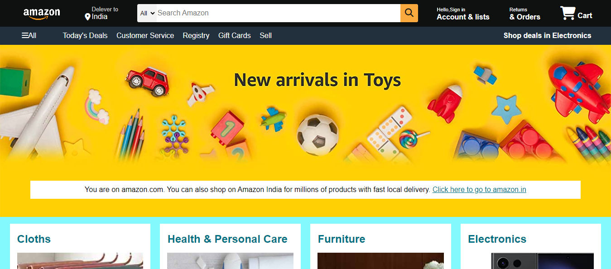

# Amazon Webpage Clone

This project is a simple clone of the Amazon website, built using HTML and CSS. It demonstrates the structure and styling of a typical e-commerce website.

## Features

- **Responsive Navigation Bar:** Includes a logo, search bar, sign-in, returns, and cart options.
- **Hero Section:** Displays a message prompting users to shop on Amazon India.
- **Shop Section:** Showcases different product categories with images.
- **Footer:** Contains links to various pages and information about the company.

## Technologies Used

- **HTML:** For the structure of the webpage.
- **CSS:** For styling the webpage.

## How to Use

1. Clone this repository.
    ```sh
    git clone https://github.com/Manikanta-484/amazon-webpage-clone.git
    ```
2. Open the `index.html` file in your preferred web browser.

## File Structure

- `index.html`: The main HTML file for the webpage.
- `style.css`: The CSS file containing styles for the webpage.
- `images/`: A directory containing images used in the project.

## Screenshot




